# Screenshots

Visual overview of Athena's interface. These screenshots are automatically generated using the [screenshot workflow](../.github/workflows/screenshots.yml).

## Capture Page

The main interface for quickly capturing thoughts.

<table>
  <tr>
    <th>Light Mode (Rosé Pine Dawn)</th>
    <th>Dark Mode (Catppuccin Mocha)</th>
  </tr>
  <tr>
    <td>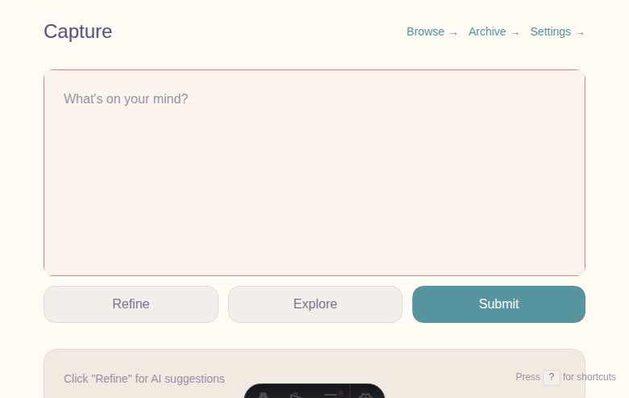</td>
    <td>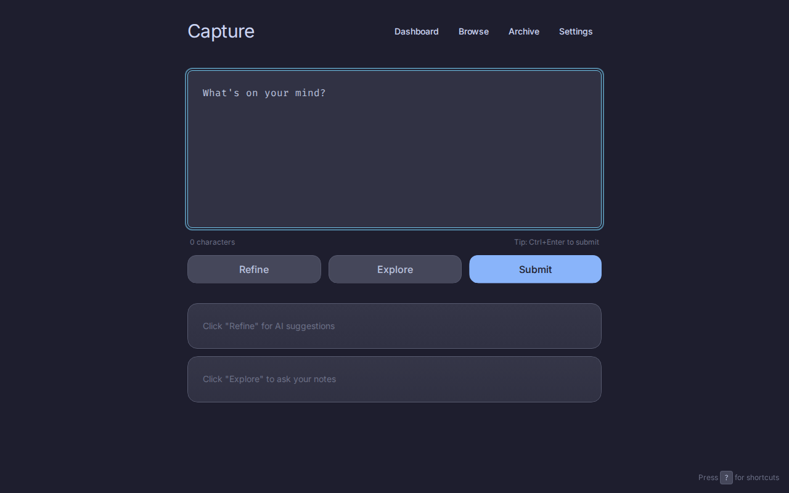</td>
  </tr>
</table>

## Desktop Views

### Dashboard
Clean stats overview with category breakdown and recent activity.

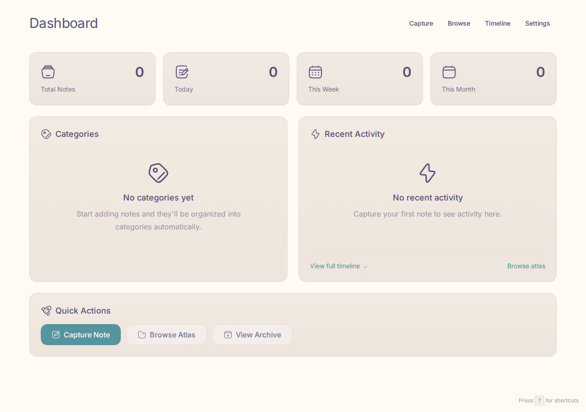

### Browse
Navigate your atlas with category-aware styling and breadcrumb navigation.

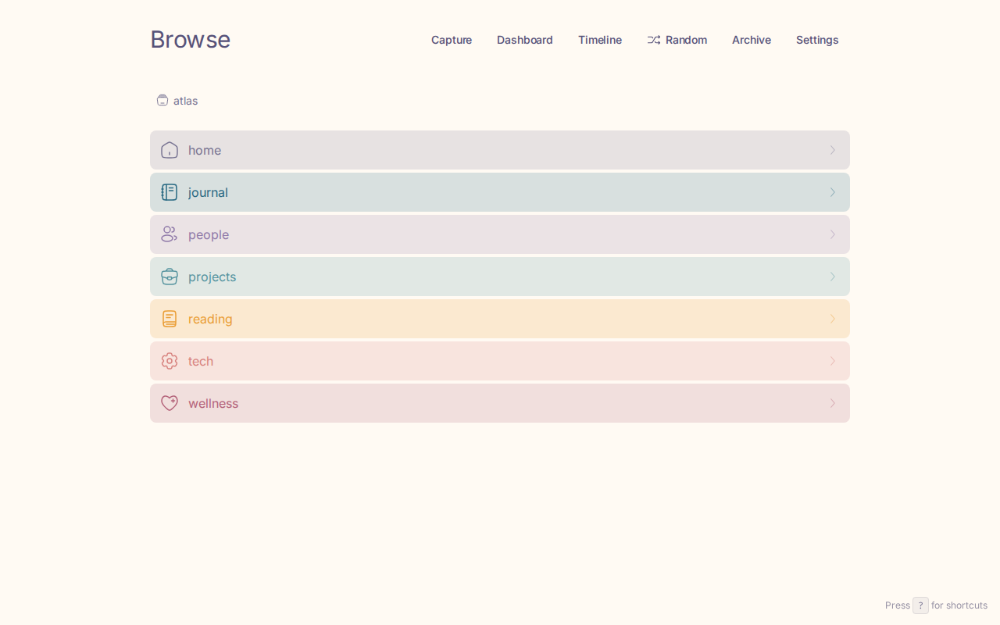

### Timeline
Chronological view of all your notes, grouped by date.

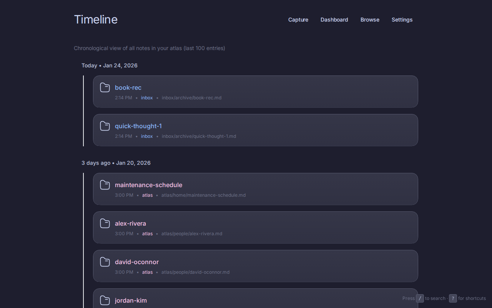

### Settings
Theme selection and font customization.

| Settings Overview | Font Selection |
|-------------------|----------------|
| 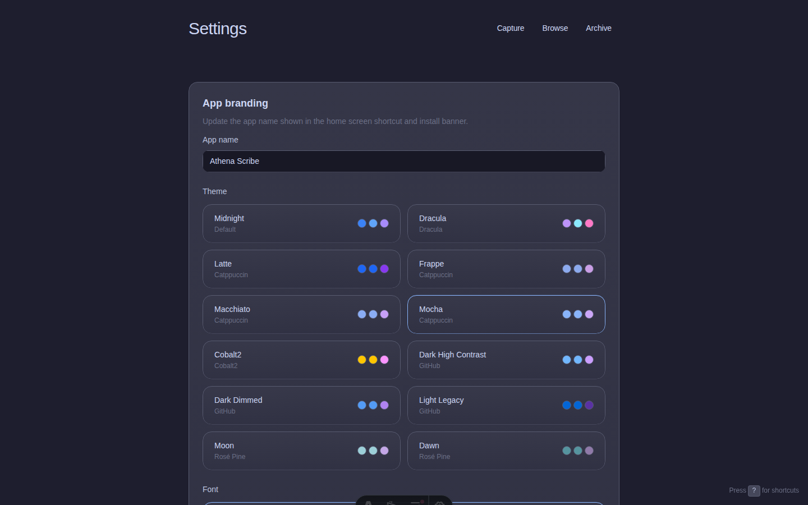 | 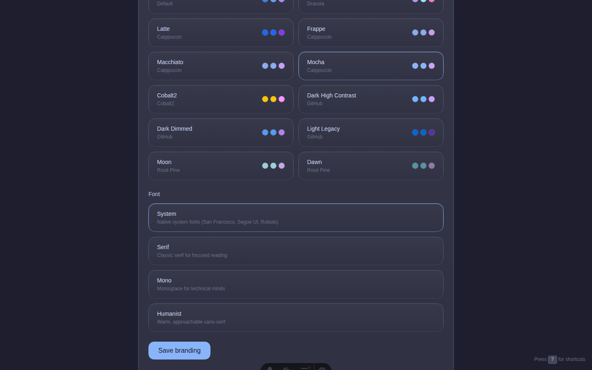 |

### Style Guide
Interactive component documentation at `/styleguide`.


## Mobile Views (390×844)

Optimized for touch with iOS-style bottom navigation.

| Capture | Dashboard | Browse |
|---------|-----------|--------|
| 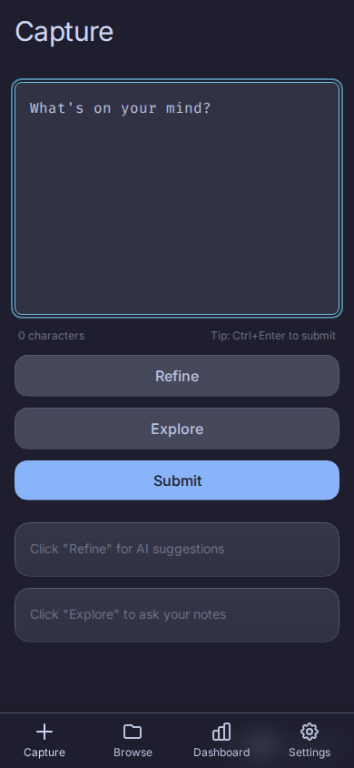 | 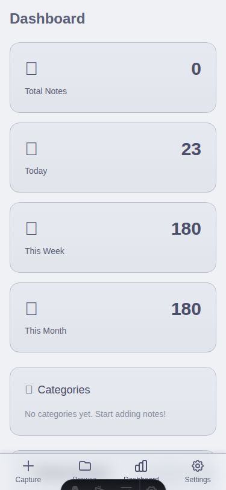 | 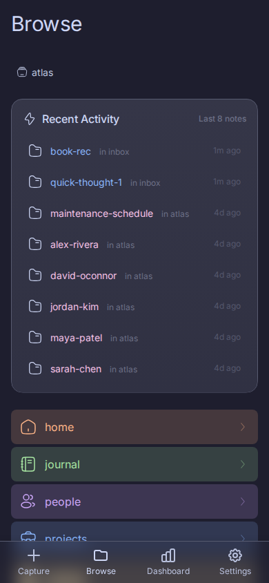 |

| Timeline | Settings | Archive |
|----------|----------|---------|
| 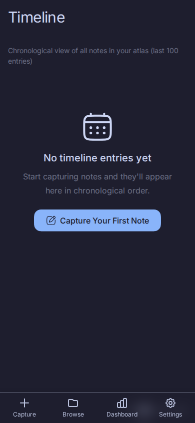 | 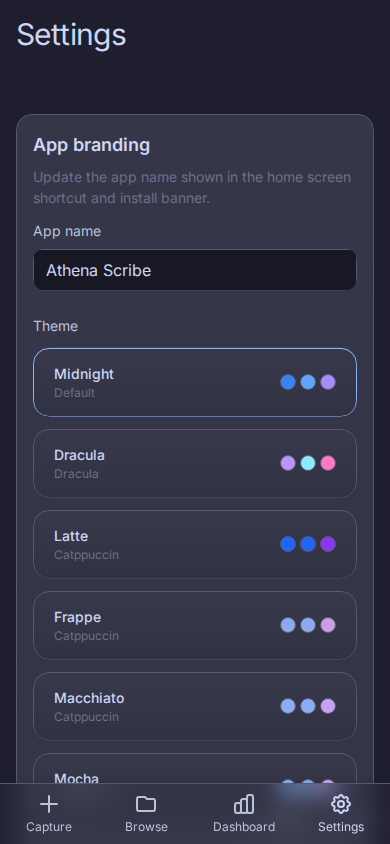 | 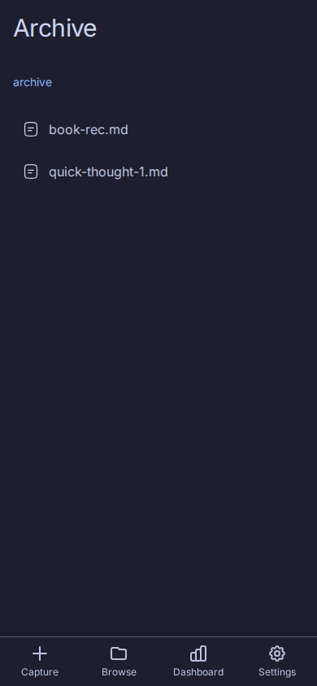 |

---

## Updating Screenshots

Screenshots are updated automatically via GitHub Actions:

1. Go to **Actions** → **Update Screenshots**
2. Click **Run workflow**
3. Optionally enter a reason for the update
4. Screenshots are committed directly to `main`

The workflow uses sample data from `.screenshot-data/athena/` to ensure consistent, realistic screenshots.

### Manual Update

To capture screenshots locally:

```bash
# Start services with sample data
docker compose -f docker-compose.screenshots.yml up -d --build

# Wait for services
sleep 30

# Run Playwright tests
cd .github/screenshots
npm install
npx playwright install chromium
npx playwright test

# Stop services
docker compose -f docker-compose.screenshots.yml down
```

### Screenshot Specifications

| Category | Viewport | Theme |
|----------|----------|-------|
| Desktop hero (light) | 1280×800 | Rose Pine Dawn |
| Desktop hero (dark) | 1280×800 | Catppuccin Mocha |
| Desktop pages | 1280×800-1200 | Rose Pine Dawn |
| Mobile | 390×844 | Catppuccin Mocha |
