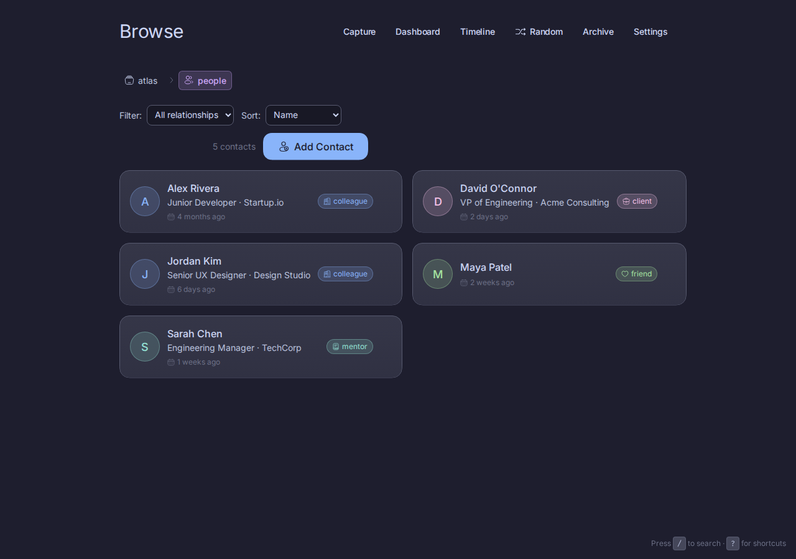
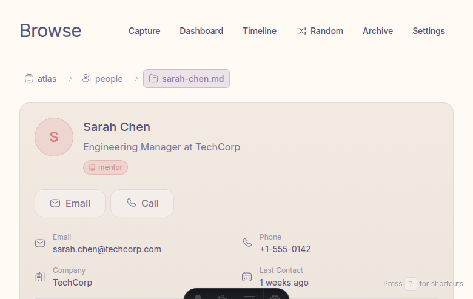
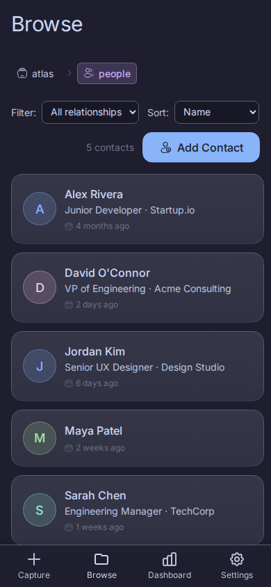

# Screenshots

Visual overview of Athena's interface. These screenshots are automatically generated using the [screenshot workflow](../.github/workflows/screenshots.yml).

All screenshots are captured in both dark mode (Catppuccin Mocha) and light mode (Rosé Pine Dawn). Dark mode is shown by default.

## Capture Page

The main interface for quickly capturing thoughts.


<details>
<summary>View in light mode</summary>


</details>

## Desktop Views

### Dashboard
Clean stats overview with category breakdown and recent activity.


<details>
<summary>View in light mode</summary>


</details>

### Browse
Navigate your atlas with category-aware styling and breadcrumb navigation.


<details>
<summary>View in light mode</summary>


</details>

### Timeline
Chronological view of all your notes, grouped by date.


<details>
<summary>View in light mode</summary>


</details>

### Contacts
Structured contact cards with grid view, filtering, and detail pages.



<details>
<summary>View in light mode</summary>


</details>



<details>
<summary>View in light mode</summary>


</details>

### Settings
Theme selection and font customization.


<details>
<summary>View in light mode</summary>


</details>


<details>
<summary>View in light mode</summary>


</details>

### Style Guide
Interactive component documentation at `/styleguide`.


<details>
<summary>View in light mode</summary>


</details>

## Mobile Views (390×844)

Optimized for touch with iOS-style bottom navigation.

### Capture


<details>
<summary>View in light mode</summary>


</details>

### Dashboard


<details>
<summary>View in light mode</summary>


</details>

### Browse


<details>
<summary>View in light mode</summary>


</details>

### Timeline


<details>
<summary>View in light mode</summary>


</details>

### Settings


<details>
<summary>View in light mode</summary>


</details>

### Archive


<details>
<summary>View in light mode</summary>


</details>

### Contacts


<details>
<summary>View in light mode</summary>


</details>

---

## Updating Screenshots

Screenshots are updated automatically via GitHub Actions:

**Automatic:** Runs on every push to `main` that changes `scribe/**` or `.github/screenshots/**`

**Manual:** Go to **Actions** → **Update Screenshots** → **Run workflow**

Screenshots are committed directly to `main`. The workflow uses sample data from `.screenshot-data/athena/` to ensure consistent, realistic screenshots.

### Manual Update

To capture screenshots locally:

```bash
# Start services with sample data
docker compose -f docker-compose.screenshots.yml up -d --build

# Wait for services
sleep 30

# Run Playwright tests
cd .github/screenshots
npm install
npx playwright install chromium
npx playwright test

# Stop services
docker compose -f docker-compose.screenshots.yml down
```

### Screenshot Specifications

| Category | Viewport | Themes |
|----------|----------|--------|
| Desktop | 1280×800-1200 | Catppuccin Mocha (default), Rosé Pine Dawn |
| Mobile | 390×844 | Catppuccin Mocha (default), Rosé Pine Dawn |
